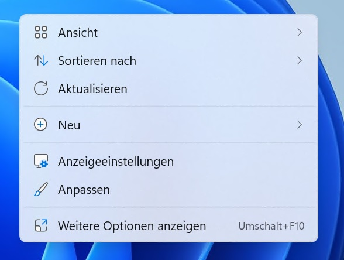
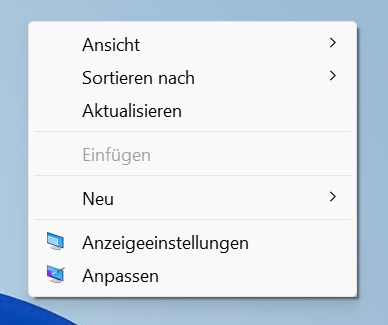

# Restore Windows 10 context menu in Windows 11
After changing the registry entry you might need to reboot your pc to see the changes.

**Windows 11 default context menu**

**Windows 11 context menu after restoration**


```
Windows Registry Editor Version 5.00

[HKEY_CURRENT_USER\Software\Classes\CLSID\{86ca1aa0-34aa-4e8b-a509-50c905bae2a2}\InprocServer32]
@=""
```

